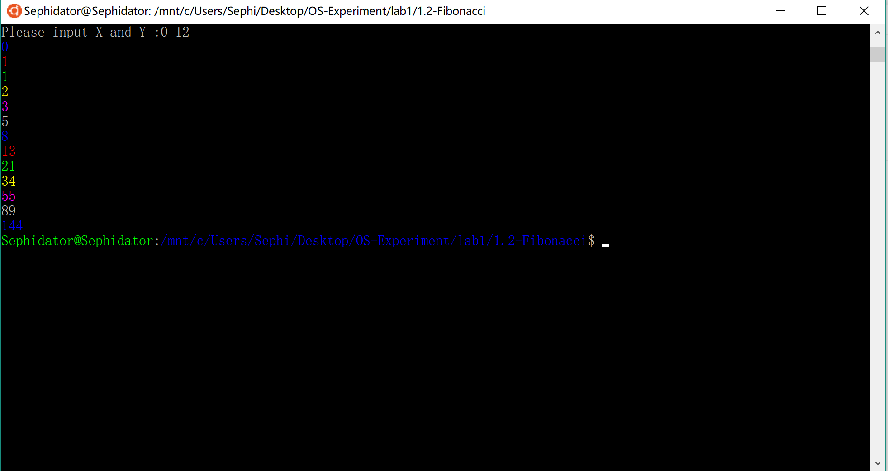

# Fibonacci

## 环境

已测试环境：Ubuntu 16.04 x64 on Windows Subsystem for Linux

理论可行环境：*nix x64

## 说明

输入两个数 x 和 y（0<x<y<200）

显示第 x 到第 y 个斐波那契数

##  执行

`nasm -f elf64 f.asm && ld f.o && ./a.out`

## 参考资料

F(201)的值

http://www.wolframalpha.com/input/?_ga=1.72399893.749436154.1435677581&i=fibonacci+201

打带颜色的字体：

https://stackoverflow.com/questions/3585846/color-text-in-terminal-applications-in-unix

https://stackoverflow.com/questions/2616906/how-do-i-output-coloured-text-to-a-linux-terminal

ASCII表

https://baike.baidu.com/pic/ASCII/309296/0/c2fdfc039245d688c56332adacc27d1ed21b2451?fr=lemma&ct=single#aid=0&pic=c2fdfc039245d688c56332adacc27d1ed21b2451

寄存器名称和顺序

https://www.cs.uaf.edu/2017/fall/cs301/reference/x86_64.html

Linux系统调用名称和参数

http://blog.rchapman.org/posts/Linux_System_Call_Table_for_x86_64/

x86_64指令表

http://www.felixcloutier.com/x86/

nasm语法（db啊什么的）

https://www.nasm.us/doc/nasmdoc3.html

windows下linux子系统

https://www.cnblogs.com/JettTang/p/8186315.html

关于a.out

https://zh.wikipedia.org/wiki/A.out